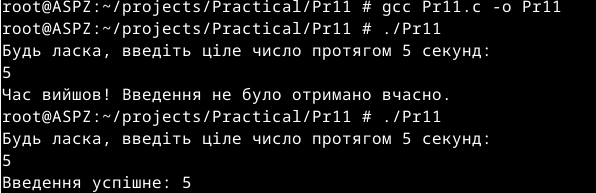

# Практична робота №12-13
Цей репозиторій cтворений для перегляду виконання практичної роботи №12-13 з дисципліни "Архітектура системного програмного забезпечення", виконане студентом Щур Р.І., групи ТВ-32.

## Завдання №24
  Створіть програму, яка використовує SIGALRM або timer_create() для тайм-аутів, але гарантує, що ніколи не втратить сигнал навіть під навантаженням.

## Виконання

Для гарантування, що сигнал не буде втрачений, я використав глобальну змінну timeout_occurred типу volatile sig_atomic_t, таке рішення повинне гарантувати, що операції читання та запису цієї змінної в обробнику сигналу є атомарними, тоді як volatile забороняє компілятору застосовувати оптимізації, що можуть приховати зміну значення від основної частини програми. Також обробник сигналу виконує лише встановлення прапору у 1, уникаючи printf. 
